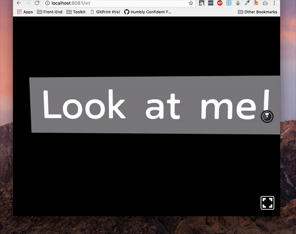

# with-awareness
👀 HOC for creating aware components in ReactVR



## Usage

```js
import React from "react";
import { AppRegistry, Text, View } from "react-vr";

// import
const withAwareness = require("with-awareness");

// create component
const AwareComponent = withAwareness(({ beingLookedAt }) => (
  <Text
    style={{
      backgroundColor: "#777879",
      fontSize: 0.8,
      fontWeight: "400",
      layoutOrigin: [0.5, 0.5],
      paddingLeft: 0.2,
      paddingRight: 0.2,
      textAlign: "center",
      textAlignVertical: "center",
      transform: [{ translate: [0, 0, -3] }]
    }}
  >
    {beingLookedAt ? "Hi there!" : "Look at me!"}
  </Text>
));
export default class example extends React.Component {
  render() {
    return (
      <View>
        <AwareComponent />
      </View>
    );
  }
}

AppRegistry.registerComponent("example", () => example);
```

## License

MIT. See [LICENSE](./LICENSE)
